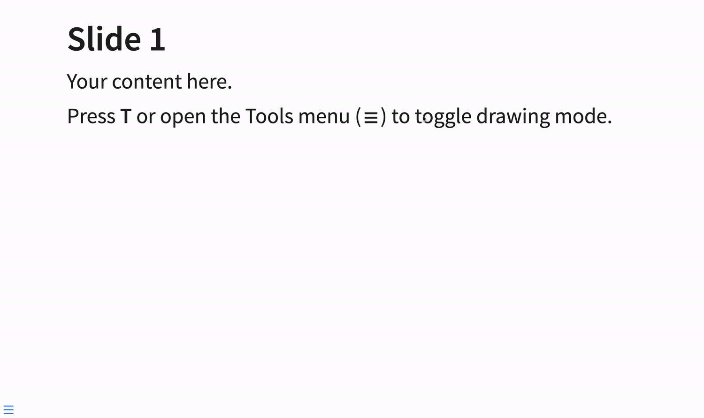

# quarto-revealjs-tldraw

A [Quarto](https://quarto.org) RevealJS extension that lets you draw on your slides using [tldraw](https://tldraw.dev) v4.



## Installation

```bash
quarto add EmilHvitfeldt/quarto-revealjs-tldraw
```

## Usage

Add the plugin to your presentation's YAML frontmatter:

```yaml
format:
  revealjs: default
revealjs-plugins:
  - tldraw
```

### Activating drawing mode

- Press **T** to toggle drawing mode on/off
- Or open the hamburger menu (☰) → **Tools** → **Toggle Drawing**
- Press **Escape** or **T** to exit drawing mode

When drawing mode is active, tldraw's full toolbar appears and slide navigation is paused. Each slide has its own drawing layer. Drawings are automatically saved to `localStorage`.

### License key

tldraw v4 requires a license key for production deployments (any `https://` URL that is not `localhost`). Without one, the editor will disappear after 5 seconds. A free 100-day trial license is available at [tldraw.dev/pricing](https://tldraw.dev/pricing).

`quarto preview` serves on `localhost` and works without a license key. For deployed presentations (e.g. Quarto Pub, GitHub Pages) you need a key.

Pass the key via your document frontmatter:

```yaml
tldraw:
  license-key: "tldraw-..."
```

## Related

- [Quarto Chalkboard](https://quarto.org/docs/presentations/revealjs/presenting.html#chalkboard) — Quarto's built-in drawing plugin, a lighter-weight alternative with a chalkboard aesthetic
- [tldreveal](https://github.com/arthurrump/tldreveal) — a plain Reveal.js plugin with a similar approach, which inspired this extension

## Development

The extension bundle is built from TypeScript source using esbuild. After cloning:

```bash
npm install
npm run build   # production build → _extensions/tldraw/tldraw.js
npm run watch   # rebuild on changes
```
